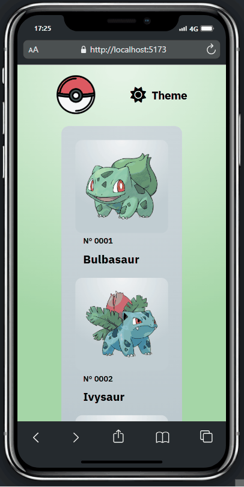

# Pokédex

Uma aplicação que permite visualizar informações de diferentes Pokémon, como nome, tipo, habilidades e imagens. Ideal para fãs da franquia Pokémon e para quem deseja praticar ou aprender desenvolvimento web com APIs.

## 🚀 Tecnologias Utilizadas

- **ReactJS**: Biblioteca JavaScript para construção de interfaces de usuário baseadas em componentes. Utilizada para estruturar e renderizar as páginas da aplicação de forma dinâmica e eficiente.

- **Vite**: Ferramenta de build e servidor de desenvolvimento ultrarrápida, utilizada para compilar e rodar o projeto React com maior desempenho.

- **Styled-Components**: Biblioteca para estilização de componentes em aplicações React, que permite escrever CSS diretamente dentro do JavaScript de forma modular e reutilizável.

- **Context API**: Ferramenta nativa do React para gerenciamento de estado global, utilizada para compartilhar dados entre componentes sem a necessidade de prop drilling.

- **API PokéAPI**: Uma API RESTful pública que fornece informações detalhadas sobre Pokémon, como nomes, tipos, habilidades, sprites e muito mais.

- **React Router DOM**: Biblioteca de roteamento para React que permite criar e gerenciar rotas de navegação na aplicação de forma declarativa.

## ⚙️ Como Rodar o Projeto

### 1. Clone este repositório

```bash
git clone https://github.com/gustavo-gsilva/pokedex.git
```

### 2. Acesse a pasta do projeto

```bash
cd pokedex
```

### 3. Instale as dependências

```bash
npm install
```

### 4. Inicie o servidor de desenvolvimento

```bash
npm run dev
```

## ✨ Funcionalidades
- **Página inicial com:**

- Imagem, nome e ID de cada Pokémon

- **🌗 Alternância de tema (Light/Dark)**

- **🔍 Página de detalhes com:**

- Imagem, nome, ID

- Tipo(s), habilidades, peso, altura e movimentos

- **⚡ Navegação fluida entre páginas com React Router**

## 📸 Demonstração


- **Página inicial versão desktop**  
  

- **Página interna versão desktop**  
  

- **Versão mobile**  
  